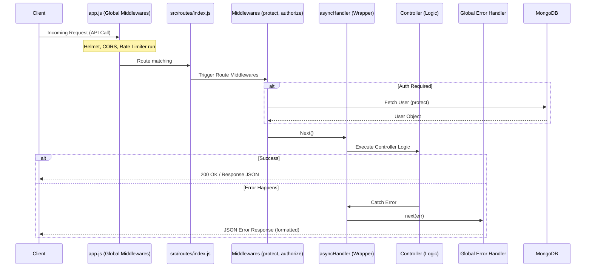

# Backend Request Flow & Architecture

Ye document explain karta hai ki aapke backend mein request kaise flow hoti hai, especially naye optimized middlewares ke saath.

## Request Flow Diagram

Aapka backend system is flow ko follow karta hai:



## Key Components Explained

### 1. Unified Error Handling
Aapka system ab consistent error responses deta hai.

- **`ErrorResponse`**: Ye class status code aur message ko ek saath handle karti hai.
- **`errorHandler`**: Ye global handler hai jo `.catch(next)` se aane waale har error ko format karta hai. Agar Mongoose ka error (Duplicate key, Validation error) aata hai, toh ye use automatic readable bana deta hai.

### 2. Boilerplate Reduction (`asyncHandler`)
Pehle aapko har controller mein `try-catch` likhna padta tha. Ab `asyncHandler` use wrap kar leta hai aur koi bhi error hone par seedha global error handler ko bhej deta hai.

```javascript
// Optimized Way
export const getProfile = asyncHandler(async (req, res, next) => {
    const user = await User.findById(req.user.id);
    res.json(user);
});
```

### 3. Layered Security
- **Global Layer**: `helmet` headers set karta hai aur `express-rate-limit` DDoS attack se bachata hai.
- **Auth Layer (`protect`)**: JWT token verify karta hai aur user ko `req.user` mein set karta hai.
- **Role Layer (`authorize`)**: Specific roles (admin/user) ko permission check karta hai.

## File Map

| File Path | Responsibility |
| :--- | :--- |
| `src/app.js` | Main entry point, global middlewares assembly. |
| `src/routes/index.js` | Main API router (Entry point for all `/api` routes). |
| `src/middleware/auth.middleware.js` | JWT verification (`protect`). |
| `src/middleware/role.middleware.js` | Role-based check (`authorize`). |
| `src/middleware/async.middleware.js` | Async error handling wrapper. |
| `src/middleware/error.middleware.js` | Formatted JSON error responses. |
| `src/utils/errorResponse.js` | Custom Error class utility. |
