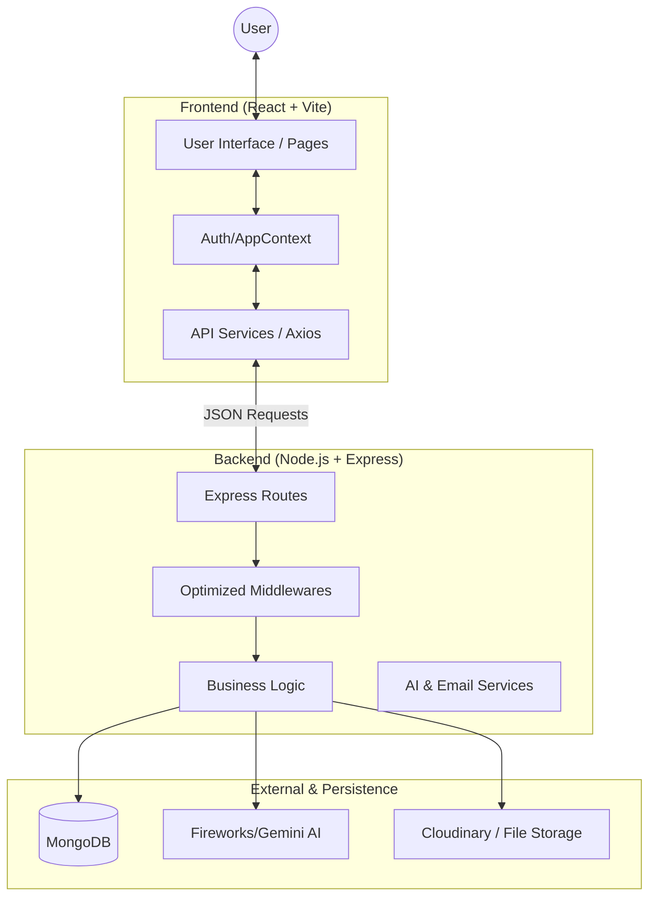
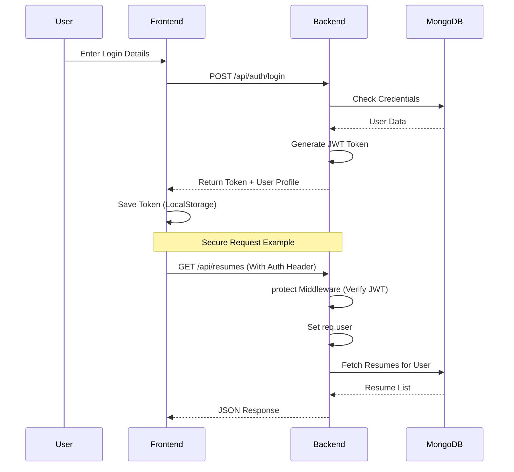
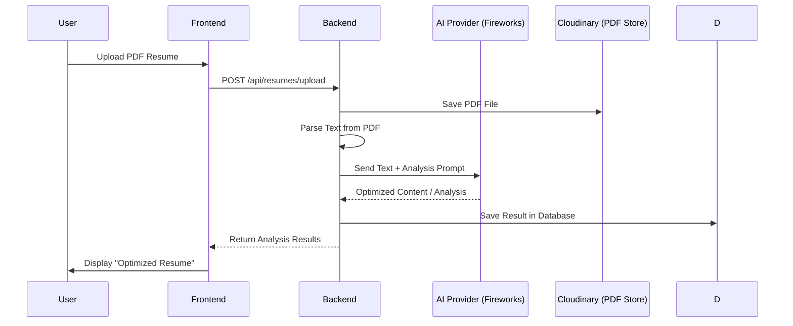

# Full Project Flow: AI Career Assistant

Ye document aapke poore project (Frontend + Backend) ka detailed architecture aur request flow explain karta hai.

## 1. High-Level Architecture
Project do main parts mein divided hai: **Frontend (React)** aur **Backend (Node/Express)**.

## 2. Core Feature Flows

### A. Authentication & Authorization Flow
Login aur data protection kaise kaam karta hai:

### B. AI Resume Analysis Flow
Resume upload se analysis tak ka flow:

## 3. Module Mapping

| Module | Frontend Page | Backend Route | Description |
| :--- | :--- | :--- | :--- |
| **Auth** | Login.jsx, Register.jsx | `/api/auth` | JWT based auth, OTP, Email Verify. |
| **Resume** | ResumeAnalysis.jsx | `/api/resumes` | PDF Parsing, AI analysis, storage. |
| **Interview** | MockInterview.jsx | `/api/interviews` | Real-time AI interview questions. |
| **Jobs** | JobList.jsx, AddJob.jsx | `/api/jobs` | Job management & listing. |
| **Chatbot** | ChatBot.jsx | `/api/chatbot` | General AI career guidance. |

---

## 4. How to get PDF

Aap is document ko PDF mein convert karne ke liye ye steps follow kar sakte hain:

1.  **VS Code Extension**: VS Code mein "Markdown PDF" extension use karke `Ctrl+Shift+P` -> `Markdown PDF: Export (pdf)` karein.
2.  **Mermaid Live Editor**: Agar sirf diagrams ki high-quality PDF chahiye, toh aap [Mermaid Live Editor](https://mermaid.live/) par ye code copy-paste karke `Download PDF` par click kar sakte hain.
3.  **Browser Print**: Is document ko open karke Chrome mein `Right Click` -> `Print` -> `Save as PDF` karein.
